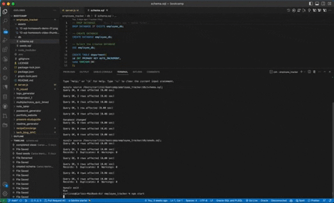

[](https://opensource.org/licenses/MIT)
# 📋 Employee Tracker

## 📌 Description

A Node.js command-line application to manage a company's employee database. This content management system is built using Node.js, Inquirer, and MySQL.


## 📖 User Story
```
AS A business owner
I WANT to be able to view and manage the departments, roles, and employees in my company
SO THAT I can organize and plan my business
```
## 🎥 Video Walkthrough
Check out the [walkthrough video](https://www.youtube.com/watch?v=gaeuipgGp00) to see the Employee Tracker in action!

## 🛠 Installation
1. Make sure you have [Node.js](https://nodejs.org/) installed.
2. Clone the repository
```bash
git clone git@github.com:carlosmb001/employee_tracker.git
```
3. Navigate to the directory
```bash
cd employee_tracker
```
4. Install the required packages
```bash
npm install
```
5. Run the application
```bash
node index.js
```
## 📋 Usage
The application provides the following options:<br>
View all departments<br>
View all roles<br>
View all employees<br>
Add a department<br>
Add a role<br>
Add an employee<br>
Update an employee role<br>
Update employee managers<br>
View employees by manager<br>
View employees by department<br>
Delete departments, roles, and employees

## 📦 Packages Used
[Inquirer v8.2.4](https://www.npmjs.com/package/inquirer/v/8.2.4)<br>
[MySQL2](https://www.npmjs.com/package/mysql2)

## 🤝 Contribution
Tutor Andres Jimenez
## 📄 License
This project is MIT licensed.
## 👏 Acknowledgements
edX Boot Camps LLC for the project prompt and resources.